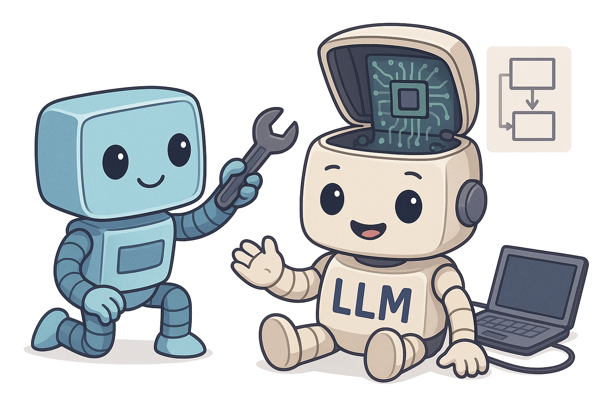

  

<h1 align="center">
    <strong>Open-Source LLM Zoomcamp: Building and Deploying LLMs on AMD Hardware</strong>
</h1>

Welcome to the Open-Source LLM Zoomcamp, where we'll explore how to build, tune, and deploy large language models together. We'll be using AMD's MI300x GPUs (hosted on Saturn Cloud) to learn hands-on with open-source LLMs.

## Who Is This For?

This course might be a good fit if you:
- Are an ML practitioner wanting to dive deeper into open-source LLM stacks
- Have a software engineering background and want to get hands-on with LLMs
- Are a researcher or open-source enthusiast interested in reproducible ML
- Work in MLOps and want to explore AMD's ROCm ecosystem

## What We'll Cover

### [Module 1: Running & Deploying Open-Source LLMs](/01-running-and-deploying-llms)
- Course overview
- Overview of open-source AI ecosystem
- Intro to Large Language Models (LLMs)
- Hugging Face and different LLMs
- Environment setup
- Introduction to ROCm and AMD GPUs
- ROCm vs CUDA
- Setting up Saturn Cloud for ROCm + MI300x
- Running Deep Seek R1 (tutorial)
- Build a simple Streamlit chat app
- Serving LLMs with vLLM
- Homework: Run and serve an LLM on Saturn Cloud

### [Module 2: Fine-Tuning & Domain Adaptation](/02-fine-tuning-domain-adaptation)
- Fine-tuning concepts
- Llama Factory workflow
- Using Llama Factory for fine-tuning
- Preparing a dataset
- Fine-tuning Deep Seek R1 (tutorial)
- Improving the chatbot from module 1
- Bonus: text-to-image models
- Homework: Fine-tune a model

## Final Project
You'll find a dataset you're interested in and fine-tune an open-source LLM for a specific domain (e.g. legal documents, medical data, or technical documentation) and deploy it so others can use it.

## How to Join?

We're starting in 2025! [Sign up here](https://airtable.com/apprlTIMJPOWhp2Kr/shrYO3Dcm6RN9f4Ko) to join us.

## Your Instructor
- [Alexey Grigorev](https://linkedin.com/in/agrigorev)

## About DataTalks.Club

DataTalks.Club is a community of data enthusiasts learning and growing together. We're all about sharing knowledge, helping each other out, and making data science more accessible.

Join us:
• [Website](https://datatalks.club/)
• [Slack Community](https://datatalks.club/slack.html)
• [Newsletter](https://us19.campaign-archive.com/home/?u=0d7822ab98152f5afc118c176&id=97178021aa)
• [Events](http://lu.ma/dtc-events)
• [Calendar](https://calendar.google.com/calendar/?cid=ZjhxaWRqbnEwamhzY3A4ODA5azFlZ2hzNjBAZ3JvdXAuY2FsZW5kYXIuZ29vZ2xlLmNvbQ)
• [YouTube](https://www.youtube.com/@DataTalksClub/featured)
• [GitHub](https://github.com/DataTalksClub)
• [LinkedIn](https://www.linkedin.com/company/datatalks-club/)
• [Twitter](https://twitter.com/DataTalksClub)

